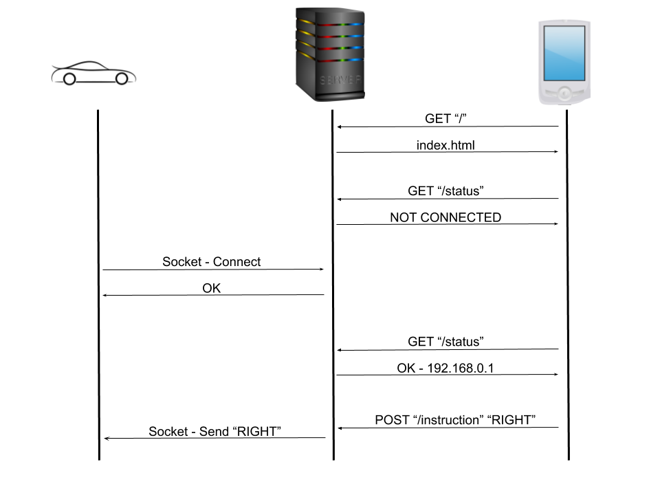
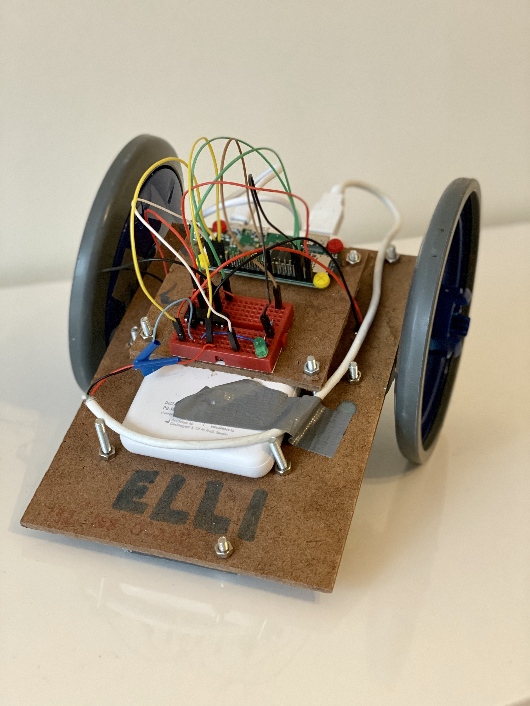
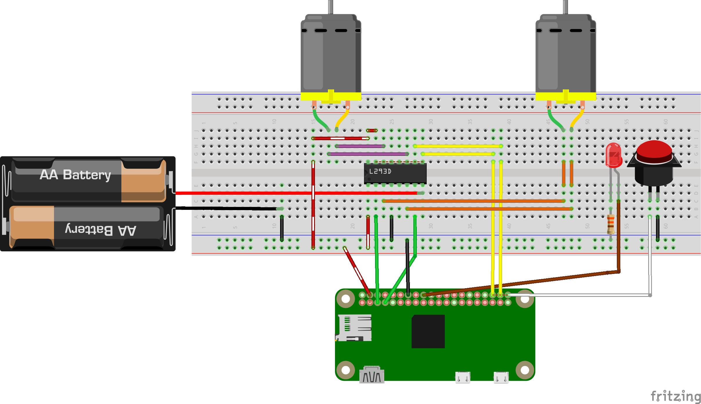

# Elli bot

Elli is a simple car like platform capable to move based on the instructions recieved over the internet.

Here is a diagram of basic communication flow:

<p align="center">
  
</p>

## Server

The server serves several roles:

- Webserver - it provides the only website - [index.html](./server/static/index.html)
- Rest Endpoint - rest endpoint for the webclient to talk to
- Socket Endpoint - for the bot to connect to

The main reason there is a server and not direct bot-client communication is that this enables to get "around" NAT translation and firwalls from private networks of the bot and client. In this case both bot and client can be in private networks (like your home wifi) and they both get to initialize their respective connection to the public resource - the Server.

### Important values

In the top of the [index.html](./server/static/index.html) there is hardcoded IP adress of the rest endpoint.

### Run

To should do following to get the required packages (1) and start the server (2) after that the webserver is accassible on [127.0.0.1:5000](http://127.0.0.1:5000)

```bash
cd server
python setup.py install # (1)
python app.py # (2)
```

## Elli code

This code should run on the raspberry PI on the bot.

### Important value

On top of the [main file](./elli/elli.py) there is a server IP address that should match the real address.

### Setup

We need to setup the code to run on the startup of the Raspberry Pi. One of the ways of doing it is to create and enable `systemd` unit.

To define a unit we need to create a file:

```bash
sudo nano /lib/systemd/system/elli.service
```

And put following content:

```
[Unit]
Description=Elli bot control
After=multi-user.target

[Service]
Type=idle
ExecStart=/usr/bin/python3 /home/pi/elli.py

[Install]
WantedBy=multi-user.target
```

Finally we need to enable the task to start on boot `(1)`, optionally start right away `(2)` and list logs `(3)`:

```bash
sudo systemctl enable elli # (1)
sudo systemctl start elli # (2)
journalctl -fu elli # (3)
```

### Hardware


<p align="center">
  
</p>

Following diagram ilustrates parts connections.

<p align="center">
  
</p>
